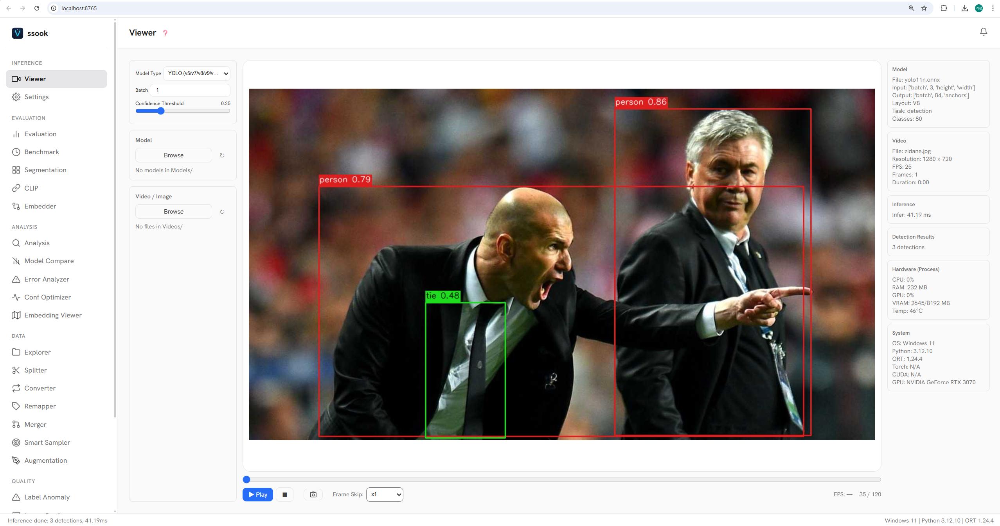

<div align="center">


# ssook

**All-in-one desktop toolkit for AI model inference, evaluation, analysis & data management**

[](https://python.org)
[](https://fastapi.tiangolo.com)
[](https://onnxruntime.ai)
[](LICENSE)
[](#)

<br>



</div>

---

## Do You Need…?

| | Feature | What it does |
|---|---|---|
| 🎬 | **Real-time Inference Viewer?** | Load an ONNX model, open a video or image, see detections/classifications live |
| 📊 | **Multi-Model Evaluation?** | Compare multiple models side-by-side with mAP, Precision, Recall, F1 |
| 🔬 | **Inference Analysis?** | Inspect letterbox, tensor heatmap, and detection results on a single image |
| ⚔️ | **Model A/B Compare?** | Run two models on the same images, navigate with a slider |
| 🎯 | **FP/FN Error Analysis?** | Auto-classify false positives & negatives by size (S/M/L) and position |
| 📈 | **Confidence Optimizer?** | Sweep thresholds per class, find the F1-maximizing confidence with PR curves |
| 🗺️ | **Embedding Visualization?** | t-SNE / UMAP / PCA 2D scatter plots from any feature extractor |
| ⚡ | **Benchmark?** | Measure FPS, latency (P50/P95/P99), CPU/GPU usage with system info export |
| 🖼️ | **Segmentation Evaluation?** | mIoU, mDice, per-class IoU/Dice against GT masks |
| 🔤 | **CLIP Zero-Shot?** | Load image + text encoders, evaluate zero-shot classification |
| 🧲 | **Embedder Evaluation?** | Retrieval@1/@K, cosine similarity, multi-image comparison |
| 📁 | **Dataset Explorer?** | Gallery with multi-class filter, box filter, class/size/aspect distribution charts |
| ✂️ | **Dataset Splitter?** | Random or stratified train/val/test split with progress tracking |
| 🔄 | **Format Converter?** | YOLO ↔ COCO JSON ↔ Pascal VOC XML batch conversion |
| 🏷️ | **Class Remapper?** | Remap, merge, or delete class IDs in bulk |
| 🔗 | **Dataset Merger?** | Combine datasets with dHash duplicate detection |
| 📊 | **Smart Sampler?** | Balanced (equal per-class + diversity), Random, Stratified sampling |
| 🛡️ | **Label Anomaly Detector?** | Find OOB boxes, size outliers, excessive overlaps |
| 🖼️ | **Image Quality Checker?** | Detect blur, brightness issues, overexposure, abnormal aspect ratios |
| 👯 | **Near-Duplicate Detector?** | dHash perceptual hashing with configurable threshold |
| 🔍 | **Leaky Split Detector?** | Cross-split (train/val/test) duplicate detection |
| 🔎 | **Similarity Search?** | Query any image → top-K most similar results |
| 🎨 | **Augmentation Preview?** | Mosaic, flip, rotate, Albumentations — preview before applying |

**All in one window. No code required.**

---

## 🤖 Supported Models

| Task | Model Format | Metrics |
|------|-------------|---------|
| **Detection** | YOLO v5/v8/v9/v11, CenterNet (Darknet), Custom ONNX | mAP@50, mAP@50:95, P/R/F1 |
| **Classification** | ONNX (2D output) | Accuracy, per-class P/R/F1 |
| **Segmentation** | ONNX (C×H×W output) | mIoU, mDice, per-class IoU/Dice |
| **VLM / CLIP** | Image Encoder + Text Encoder ONNX | Zero-shot Classification |
| **Embedder** | ONNX (feature extractor) | Retrieval@1/@K, Cosine Similarity |

> Fixed-batch models (e.g., batch=4) are automatically detected and handled.

---

## 🚀 Getting Started

### Option 1: Download Release (Recommended)

Download the latest release from [Releases](../../releases):
- **Windows**: `.msi` installer or `.zip` portable
- **macOS**: `.dmg` disk image

Just run — no Python needed.

### Option 2: Run from Source

Requires Python **3.10+**.

```bash
git clone https://github.com/surrealier/ssook.git
cd ssook

pip install -r requirements-web.txt

# Optional extras
pip install matplotlib scikit-learn openpyxl   # charts & Excel export
pip install umap-learn                          # UMAP embedding
pip install pywebview                           # native desktop window
pip install onnxruntime-gpu                     # CUDA acceleration

# EP venv 격리 설치 (GPU/DirectML/OpenVINO/CoreML 동시 공존)
python scripts/setup_ep.py                      # 플랫폼 전체 EP 설치
python scripts/setup_ep.py cuda cpu             # 특정 EP만 설치
python scripts/setup_ep.py --status             # 설치 상태 확인

python run_web.py
```

| Flag | Description |
|------|-------------|
| `--port 9000` | Custom port (default: 8765) |
| `--browser` | Force browser mode instead of native window |

---

## 📖 Quick Start

```
1. Launch  →  Settings tab  →  Download test models & sample data
2. Viewer tab  →  Open video/image  →  See real-time inference
3. Evaluation tab  →  Add models, set GT labels  →  Run evaluation
4. Analysis tab  →  Dive into FP/FN, confidence optimization, embeddings
5. Data tab  →  Explore, split, convert, clean your dataset
```

---

## ⚙ Configuration

Settings are stored in `settings/app_config.yaml` and persist across sessions:

```yaml
model_type: yolo
conf_threshold: 0.25
batch_size: 1
box_thickness: 2
label_size: 0.55
show_labels: true
show_confidence: true
```

---

## 📦 Dependencies

### Required (`requirements-web.txt`)

| Package | Purpose |
|---------|---------|
| fastapi | Web backend |
| uvicorn | ASGI server |
| opencv-python | Image/video processing |
| numpy | Numerical operations |
| onnxruntime | ONNX model inference |
| psutil | System resource monitoring |
| PyYAML | Configuration management |

### Optional

| Package | Purpose |
|---------|---------|
| pywebview | Native desktop window (instead of browser) |
| matplotlib | Charts, scatter plots, PR curves |
| scikit-learn | t-SNE, PCA dimensionality reduction |
| openpyxl | Excel report export |
| umap-learn | UMAP embedding visualization |
| onnxruntime-gpu | CUDA/TensorRT acceleration |

---

## 🧪 Testing

```bash
python -m pytest tests/ -v
```

---

## 📋 Changelog

### v1.4.0
- **EP venv Isolation**: onnxruntime 변종별 독립 venv 격리 (`ep_venvs/`) — GPU/DirectML/OpenVINO/CoreML/CPU 동시 공존
- **Auto EP Selection**: 플랫폼·하드웨어 기반 최적 Execution Provider 자동 선택
- **CoreML Support**: macOS Apple Silicon CoreMLExecutionProvider 지원
- **OpenVINO GPU-first**: OpenVINO EP가 Intel iGPU 우선 시도, 불가 시 OpenVINO CPU 폴백
- **Cross-platform Setup**: `python scripts/setup_ep.py` 단일 스크립트로 Windows/Linux/macOS EP 설치

### v1.3.2
- **Bugfix**: Fix Internal Server Error (index.html missing from build)
- **Bugfix**: Fix frozen exe path resolution (`sys._MEIPASS`)
- **pywebview**: Native desktop window as default, browser as fallback

### v1.3.1
- **Sample Data**: Built-in test images (bus.jpg, zidane.jpg) and video (people.mp4)
- **COCO128**: Dataset download link in Settings tab
- **Bugfix**: Fix frozen exe crash (`sys.stderr=None` in PyInstaller)

### v1.3.0
- **Smart Sampler**: Balanced mode now distributes target count equally across classes with farthest-point sampling for spatial diversity
- **Progress Bars**: All tabs unified to explorer-style progress bar (20px height, % text overlay)
- **Remapper**: Converted to async with progress tracking
- **Removed**: Batch Inference tab (redundant with Viewer); Augmentation moved to Data section

### v1.2.0
- **Explorer**: Async loading with progress bar, double-click image preview with bbox overlay, multi-class checkbox filter, box operator filter (>=, =, <=), 5 view modes (file list, class distribution by box/image, box size distribution, aspect ratio distribution)
- **Splitter**: Strategy selection (random / stratified), custom ratio inputs, 0-ratio skip, progress bar
- **Conf Optimizer**: Per-class PR curve visualization, F1 display fix
- **Embedder**: Multi-image cosine similarity comparison
- **Recursive folder support**: Remapper, Merger, Sampler, Anomaly Detector, Quality Checker, Duplicate Detector
- **Merger**: dHash threshold description and input binding
- **i18n**: Korean translations for new UI elements

### v1.1.0
- Web UI overhaul with analysis tabs, class mapping, model downloads
- Benchmark system info export
- Rebrand to ssook

---

## 📄 License

[MIT License](LICENSE)

---

<div align="center">

[⬆ Back to Top](#ssook)

</div>
